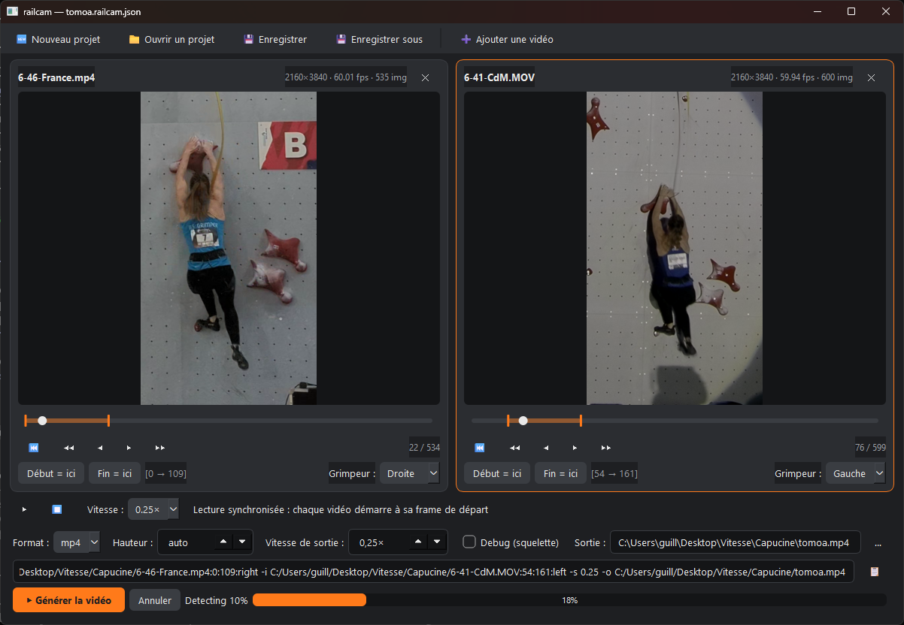

# railcam

**railcam** is a CLI tool that turns raw climbing footage into clean, analysis-ready videos by automatically following the climber — as if filmed on a perfectly aligned vertical rail.

Designed for **speed climbing analysis**, coaching, and side-by-side comparisons, railcam uses AI pose estimation to lock onto the climber’s pelvis, producing smooth, tightly framed videos with consistent scale and zero manual editing.

---

## Example

> ⬇️ Example output generated by railcam
> *(automatic tracking, normalized zoom, smooth vertical motion)*


---

## Why railcam?

* No manual cropping or keyframing
* No shaky framing or inconsistent zoom
* No post-processing in a video editor

Just reproducible, normalized clips ready for **performance analysis, coaching, or sharing**.

---

## Key Features

* **AI-based climber tracking**
  Automatic pelvis tracking using YOLOv8-pose for stable, body-anchored framing.

* **Dual-lane aware**
  Reliably track the left or right climber in official speed walls and race footage.

* **Rail-like camera motion**
  Smooth vertical tracking with interpolation and exponential smoothing.

* **Smart vertical crop (5:3)**
  Tight framing optimized for climbers, with no black borders.

* **Automatic zoom normalization**
  Consistent climber size based on torso height, across videos.

* **Side-by-side composition**
  Compare multiple climbers or runs in a single synchronized output.

* **Per-video label**
  Optional name displayed in a band under each video, with a smaller second
  line for the time, so a comparison says who is who.

* **MP4 & GIF output**
  High-quality H.264 MP4 or lightweight GIF.

* **Debug mode**
  Pose skeleton overlay for inspection and validation.

* **Cross-platform**
  macOS, Linux, Windows.

---

## Installation

### Prerequisites

* Python **3.9+**
* **FFmpeg** (video/GIF rendering)

Install FFmpeg:

```bash
# macOS
brew install ffmpeg

# Ubuntu / Debian
sudo apt install ffmpeg

# Windows
# Download from https://ffmpeg.org/download.html
```

### Install railcam

```bash
pip install .
```

With the desktop GUI (see below):

```bash
pip install ".[gui]"
```

Development install:

```bash
pip install -e ".[dev,gui]"
pre-commit install  # Auto-setup git hooks (LFS check, linting)
```

---

## Quick Start

```bash
# Generate a tracked MP4
railcam video.mp4 100 250

# Track left climber on a dual-lane wall
railcam video.mp4 100 250 --climber left

# Side-by-side comparison
railcam \
  --input video.mp4:100:250:left \
  --input video.mp4:100:250:right

# Named side-by-side comparison
railcam \
  --input run1.mp4:100:250 --label "Dupont" \
  --input run2.mp4:80:230  --label "Martin"
```

---

## Desktop GUI

Prefer picking frames visually? Install the `gui` extra and run:

```bash
railcam-gui
```



The GUI lets you:

- Load one or more videos side by side and scrub them frame by frame
  (arrow keys: ±1 frame, Shift+arrows: ±10)
- Zoom into a detail with the mouse wheel (drag to pan, double-click to
  reset) — the view persists while stepping through frames, ideal for
  finding the exact start frame
- Set each video's start/end frame from the displayed image — start frames
  are the synchronization points (t=0), exactly like the CLI
- Choose the climber (auto/left/right) per video
- Give each video a **Légende** and an optional **Sous-légende** — the texts
  displayed under its image in the rendered file, the second one smaller
  (leave them empty to render without a band)
- Play all videos synchronized in slow motion (space bar to play/pause)
  to check the timing before rendering
- Configure render options, see the equivalent CLI command live (copyable),
  and launch the render with an overall progress bar covering detection,
  processing and encoding
- Manage sessions as `.railcam.json` project files (new / open / save /
  save as), with relocation of moved video files on open

---

## Usage

### Single Video Mode

```bash
railcam VIDEO START_FRAME END_FRAME [OPTIONS]
```

**Arguments**

* `VIDEO` – Input video file
* `START_FRAME` – Start frame (0-indexed, inclusive)
* `END_FRAME` – End frame (0-indexed, inclusive)

---

### Multi-Video / Side-by-Side Mode

```bash
railcam \
  --input VIDEO1:START:END[:CLIMBER] \
  --input VIDEO2:START:END[:CLIMBER] \
  [OPTIONS]
```

Each input is processed independently, then composed horizontally.

---

### Options

| Option                                     | Description             |
| ------------------------------------------ | ----------------------- |
| `-i, --input PATH:START:END[:left\|right]` | Input spec (repeatable) |
| `-c, --climber {left,right}`               | Select climber          |
| `--label TEXT`                             | Label under a video (repeatable) |
| `--sublabel TEXT`                          | Second label line, smaller (repeatable) |
| `-o, --output PATH`                        | Output path             |
| `-f, --format {mp4,gif}`                   | Output format           |
| `-w, --width PIXELS`                       | Output width            |
| `-H, --height PIXELS`                      | Output height           |
| `-s, --speed FACTOR`                       | Playback speed          |
| `--model {n,s,m,l,x}`                      | Detection model size    |
| `--imgsz PIXELS`                           | Detection resolution    |
| `--debug`                                  | Pose overlay            |
| `-v, --version`                            | Show version            |
| `-h, --help`                               | Show help               |

#### Detection model size

`--model` picks the YOLOv8-pose variant, from `n` (fastest) to `x` (most
accurate). The default is `s`.

Detection dominates render time, so this is the main speed lever: `n` is several
times faster than `m` on the same footage. Frames where the climber is missed are
re-run at high resolution regardless of the model, so a lighter model costs less
accuracy than the raw benchmark numbers suggest. Use `--model m` if the tracking
wanders on difficult footage.

The GUI exposes the same choice as **Détection** in the render options.

#### Detection resolution

Detection downscales every frame to a square before inference, so a fixed size
makes the climbers shrink with the source resolution: on a 4K wide shot of a
15 m wall they end up around 40 px tall and are simply not found — nothing
fails, the run just tracks whoever was still detected.

`--imgsz` therefore defaults to half the source's largest side, clamped to
[640, 1920]: 1920 for 4K, 1280 for 1440p, 960 for 1080p, 640 below that. Raise
it when climbers are small in a wide shot, lower it for a faster run. Frames the
selected climber is missing are re-run at twice that size (capped at 2560).

The GUI exposes it as **Résolution** in the render options, where `auto` means
the source-derived default.

#### Video labels

`--label` writes a text under a video, centered in a solid black band appended
below the image. Labels default to empty: without `--label`, the output is
exactly what it was before.

`--label` is repeatable and paired with the inputs **in the order they are
given**:

```bash
railcam \
  --input run1.mp4:100:250 --label "Dupont" \
  --input run2.mp4:80:230  --label "Martin"
```

Inputs left without a label get an empty band. Giving more labels than inputs,
or more than one label in single-video mode, is an error.

Labels are drawn as typed, accents included, with the DejaVu Sans font bundled
with railcam (so a label looks the same on every machine). A label starting with
a dash must use the attached form, `--label="-Dupont"`, otherwise it is read as
an option name.

`--sublabel` adds an optional second line under the label, drawn smaller — for
the name on the first line and the time, category or date on the second:

```bash
railcam \
  --input run1.mp4:100:250 --label "Dupont" --sublabel "4.704" \
  --input run2.mp4:80:230  --label "Martin" --sublabel "5.120"
```

It follows the same rules as `--label`: repeatable, paired with the inputs in
the order they are given, empty by default, attached form `--sublabel="-0.120"`
for a text starting with a dash. It can be used without a `--label`, in which
case the first line stays empty.

Note: the band is added *under* the 5:3 crop, so a labeled output is slightly
taller than 5:3, and taller again when a second line is used. The image itself
keeps its 5:3 ratio and its zoom normalization — in multi-video mode every video
gets the same lines, at the same relative size, as soon as one of them uses
them.

The GUI exposes both as **Légende** and **Sous-légende** on each video card.

---

## How It Works

1. Extract frames from the requested range
2. Detect poses with YOLOv8-pose (all persons per frame)
3. Filter to persons with visible pelvis
4. Group detections into motion tracks and select the climber by movement:
   static bystanders never win, `left`/`right`/`auto` apply among the
   tracks that actually climb
5. Measure torso height (shoulder ↔ hip)
6. Normalize zoom level
7. Interpolate gaps and smooth motion
8. Compute centered 5:3 crop
9. Render MP4 or GIF via FFmpeg

---

## Zoom Normalization

* Average torso height is measured across frames
* Zoom adjusted so torso ≈ **1/3 of output height**
* Zoom clamped between **1.0× and 3.0×**

This ensures meaningful visual comparison across clips.

---

## Supported Input Formats

MP4 · AVI · MOV · MKV · WebM · M4V

---

## Help

```bash
railcam --help
```

---

## License

MIT
